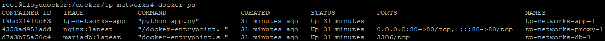

# Projet Docker : Isolation réseau backend_net

Ce projet met en place une infrastructure Docker avec trois services :
- db : base de données MariaDB
- app : application Flask qui interroge la base
- proxy : serveur Nginx en reverse proxy

## Objectif Bonus

Empêcher la VM d'accéder à la base de donnée. 

## Configuration Docker-Compose

```yaml
version: '3.9'

networks:
  backend_net:
    driver: bridge
    ipam:
      driver: default
      config:
        - subnet: 172.30.0.0/24
  frontend_net:
    driver: bridge
    ipam:
      driver: default
      config:
        - subnet: 172.30.1.0/24

services:
  db:
    image: mariadb:latest
    environment:
      MYSQL_ROOT_PASSWORD: rootpass
      MYSQL_DATABASE: appdb
      MYSQL_USER: appuser
      MYSQL_PASSWORD: apppass
    networks:
      - backend_net
    restart: unless-stopped
    cap_add:
      - NET_ADMIN
    volumes:
      - ./init-firewall.sh:/docker-entrypoint-initdb.d/init-firewall.sh:ro
    command: >
      bash -c "
      apt-get update && apt-get install -y iptables &&
      /docker-entrypoint-initdb.d/init-firewall.sh &
      docker-entrypoint.sh mariadbd
      "

  app:
    build: ./app
    environment:
      DB_HOST: db
      DB_USER: appuser
      DB_PASS: apppass
      DB_NAME: appdb
    networks:
      - backend_net
    restart: unless-stopped

  proxy:
    image: nginx:latest
    volumes:
      - ./proxy/nginx.conf:/etc/nginx/conf.d/default.conf:ro
    ports:
      - "80:80"
    networks:
      - frontend_net
      - backend_net
    restart: unless-stopped
```

## Dockerfile app

```dockerfile
FROM python:3.11-slim

WORKDIR /app

COPY app.py /app/

RUN pip install flask pymysql

CMD ["python", "app.py"]
```

## Architecture réseau

- **backend_net (172.30.0.0/24)** : réseau interne pour la base de données et l'application
  - db : 172.30.0.3 (exemple)
  - app : 172.30.0.2 (exemple)
  - proxy : 172.30.0.4 (exemple)

- **frontend_net (172.30.1.0/24)** : réseau pour le proxy exposé à l'extérieur
  - proxy : 172.30.1.2 (exemple)

- **proxy** : en tant qu'intermédiaire connecté aux deux réseaux

## Phases de test pour vérifier le fonctionnement

### Phase 1 : Démarrage des services

1. Lancez les conteneurs :
```bash
docker-compose up -d
```

2. Vérifiez que tous les conteneurs sont en cours d'exécution :
```bash
docker-compose ps
```



Vous devez voir les trois services en état `up`.

### Phase 2 : Accès via le proxy depuis la VM

1. Depuis votre machine, ouvrez un navigateur et allez à :
```
http://ip_VM/
```

Vous devez voir "Hello from app!" s'afficher.

2. Testez le endpoint health :
```

http://ip_VM/health
```

Vous devez obtenir :
```json
{"status":"ok","db":"reachable"}
```

### Phase 3 : Vérification de l'isolation réseau

1. depuis la Vm essayer de se conecter à la base de donnée. Si timeout alors la protection fonctionne. 

2. En amélioration, directement depuis la bdd, accepter les requêtes uniquement du conteneur app web.

### Phase 4 : Tests avancés

1. Vérifiez que les conteneurs sont connecté au bon réseaux :
```bash
docker network inspect tp-networks_backend_net
docker network inspect tp-networks_frontend_net
```

## Commandes utiles

### Vérifier les logs des conteneurs
```bash
docker-compose logs db
docker-compose logs app
docker-compose logs proxy
```

### Afficher les configurations réseau
```bash
docker network ls
docker network inspect tp-networks_backend_net
docker network inspect tp-networks_frontend_net
```

### Accéder à un conteneur en shell
```bash
docker-compose exec app bash
docker-compose exec db bash
docker-compose exec proxy bash
```

### Arrêter et nettoyer
```bash
docker-compose down
docker network prune -f
```

### Vérifier les règles iptables actives
```bash
sudo iptables -L -n 
```

## Résumé de l'isolation

| Accès | Depuis | Vers | Résultat |
| --- | --- | --- | --- |
| VM -> proxy (http) | 10.5.x.x | port 80 (proxy) | AUTORISÉ |
| proxy -> app | frontend_net | backend_net | AUTORISÉ |
| proxy -> db | frontend_net | backend_net | AUTORISÉ |
| app -> db | backend_net | backend_net | AUTORISÉ |
| VM -> db (direct) | 10.5.x.x | 172.30.0.x (db) | BLOQUÉ |

## Conclusion

L'isolation du réseau backend_net est garantie par :
1. La création de deux réseaux Docker distincts
2. Le proxy en tant que seul intermédiaire entre frontend et backend
3. Aucun port exposé pour la base de données
4. Une règle firewall côté bdd bloquant la VM

Seul le proxy peut communiquer avec l'application et la base, tandis que la VM accède à l'application via le proxy sur le port 80.
